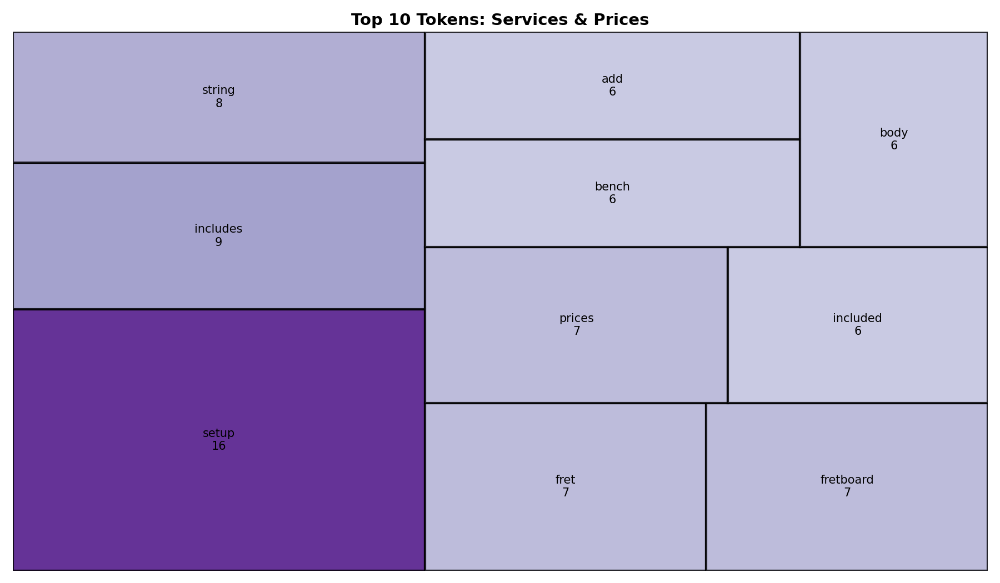
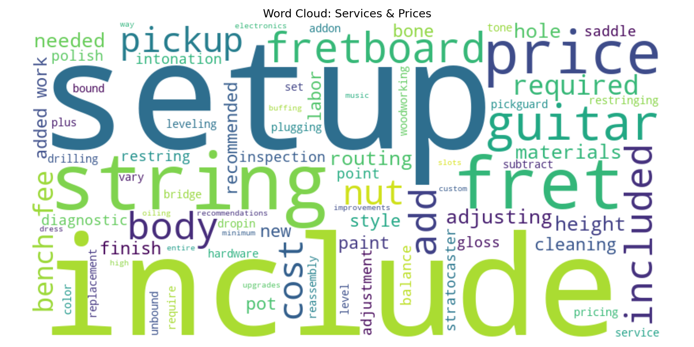

# NLP Portfolio: Web Mining and Applied NLP

## Overview

This portfolio highlights my work applying an EVTAL NLP pipeline to a real-world website, specifically a custom guitar services and pricing page. I extracted and analyzed text from the services page, cleaned and processed the content using Python, and generated visualizations such as a treemap and word cloud to identify key service-related terms like setup, fret work, and string adjustments.

---

## 1. NLP Techniques Implemented

- **Tokenization:** Split cleaned text into individual tokens (words) using spaCy
- **Text Cleaning and Normalization:** Lowercasing, removing punctuation, removing stopwords, and normalizing whitespace
- **Frequency Analysis:** Computed token frequency and identified top terms using `Counter`
- **Web Scraping / HTML Extraction:** Extracted text content from web pages using BeautifulSoup
- **Visualization:** Created treemap and word cloud visualizations to represent token frequency

---

## 2. Systems and Data Sources

- **HTML web pages:** Extracted content from a custom guitar services website
- **Structured vs unstructured data:** Handled raw HTML and converted it into structured DataFrame format
- Extracted service descriptions, pricing-related text, and technical guitar terminology from the website

To handle messy and/or inconsistent data:

- Removed symbols and non-meaningful tokens (e.g., punctuation and special characters)
- Combined multiple paragraph elements into a single clean text field
- Normalized whitespace and filtered stopwords

**Source Website:** [S7 Custom Guitars Services Page](https://s7customguitars.com/services/)

---

## 3. Pipeline Structure (EVTL)

I implemented a full EVTAL pipeline:

**Extract:** Pulled HTML from a live website and saved raw content

- [Extract Stage Code](https://github.com/ssowers2/nlp-06-nlp-pipeline/blob/main/src/nlp/stage01_extract.py)

**Validate:** Checked for required elements such as headings and paragraph tags

- [Validate Stage Code](https://github.com/ssowers2/nlp-06-nlp-pipeline/blob/main/src/nlp/stage02_validate_sowers_project.py)

**Transform:** Cleaned text, tokenized, and computed features (token counts, ratios)

- [Transform Stage Code](https://github.com/ssowers2/nlp-06-nlp-pipeline/blob/main/src/nlp/stage03_transform_sowers_project.py)
- Combined multiple paragraph elements from the services page into a single text field for analysis
- Removed symbols, punctuation, and non-meaningful tokens (e.g., "-", special characters)

**Analyze:** Generated treemap and word cloud visualizations and frequency summaries

- [Analyze Stage Code](https://github.com/ssowers2/nlp-06-nlp-pipeline/blob/main/src/nlp/stage04_analyze_sowers_project.py)

**Load:** Saved processed data to CSV

- [Load Stage Code](https://github.com/ssowers2/nlp-06-nlp-pipeline/blob/main/src/nlp/stage05_load.py)

**Files:**

- [Processed CSV](https://github.com/ssowers2/nlp-06-nlp-pipeline/blob/main/data/processed/sowers_processed_project.csv)

**Image 1: Treemap**

**Image 2: Wordcloud**

**Pipeline file:**

- [Pipeline File](https://github.com/ssowers2/nlp-06-nlp-pipeline/blob/main/src/nlp/pipeline_web_html_sowers_project.py)

---

## 4. Signals and Analysis Methods

- **Word frequency:** Identified most common service-related terms (e.g., setup, string, fret)
- **Vocabulary richness:** Calculated type-token ratio
- **Token counts:** Total and unique token counts
- **Visual signals:** Treemap and word cloud to show importance and patterns
- Code: `Counter(tokens)` in analyze stage
- Output logs showing ranked token frequency
- Visualization files in `docs/images/`

---

## 5. Insights

- The most frequent terms included **"setup"**, **"string"**, **"fret"**, and **"included"**
- This reflects how the website emphasizes bundled services and detailed guitar setup work rather than general descriptions
- These terms indicate a strong focus on guitar setup and maintenance services
- The treemap clearly showed the relative importance of each term based on size and color
- The results reflect domain-specific language used in a real business setting
- Visualizations made it easier to quickly understand key themes
- This demonstrates how NLP can be used to quickly understand the focus of a business website without manually reviewing all content.

---

## 6. Representative Work

### Project 1: Guitar Services NLP Pipeline

- [Link to Project](https://github.com/ssowers2/nlp-06-nlp-pipeline)

This project applies an EVTAL NLP pipeline to a real-world website. It extracts, cleans, and analyzes text, producing visualizations that highlight key service-related terms.

### Project 2: KISS Network Website Pipeline

- [Link to Project](https://github.com/ssowers2/nlp-05-web-documents)

This project applies the EVTL pipeline to a new HTML website (KISS Network), demonstrating how the pipeline can be adapted to different page structures by updating validation and transformation logic. It highlights the ability to extract, restructure, and engineer features from real-world web content.

### Project 3: Text Exploration and Corpus Analysis

- [Link to Project](https://github.com/ssowers2/nlp-03-text-exploration)

This project explores a custom text corpus using tokenization, frequency analysis, co-occurrence, and bigrams to identify patterns in text before applying machine learning. It demonstrates foundational NLP skills and the ability to analyze and compare vocabulary across categories.

---

## 7. Skills

- **Web data extraction:** Extracting and processing real-world text data from HTML websites using Python and BeautifulSoup
- **HTML parsing:** Extracting structured content from raw HTML pages
- **Text cleaning and normalization:** Removing punctuation, stopwords, and non-meaningful tokens to prepare text for analysis
- **Text tokenization and preprocessing:** Tokenizing text and preparing structured datasets for NLP analysis
- **Domain-specific text interpretation:** Interpreting domain-specific terminology (e.g., guitar setup, fret work) through NLP analysis
- **EVTAL pipeline development:** Building and modifying multi-stage data pipelines (Extract, Validate, Transform, Analyze, Load)
- **Pipeline adaptation:** Adjusting validation and transformation logic to handle different data sources and structures
- **Data validation:** Ensuring required fields and correct structure before processing data
- **Handling inconsistent data:** Managing missing fields, structural differences, and real-world data variability
- **Derived feature engineering:** Creating new fields (e.g., text length, token counts) to enhance analysis
- **Frequency and pattern analysis:** Computing token frequencies and identifying common terms and patterns
- **Context analysis:** Using co-occurrence and bigrams to understand relationships between words
- **Categorical text analysis:** Organizing and comparing text data across categories (e.g., cupcake, cake, pie)
- **Data visualization:** Creating and customizing visualizations (bar charts, treemaps, word clouds) using Matplotlib
- **Reproducible workflows:** Structuring projects and workflows for consistent, repeatable results
- **Version control:** Managing projects using Git and GitHub, including commits and troubleshooting issues
- **Data organization:** Managing datasets and outputs to maintain clean, non-overwritten results
- **Technical communication:** Presenting analysis, insights, and results clearly using Markdown and visual outputs
